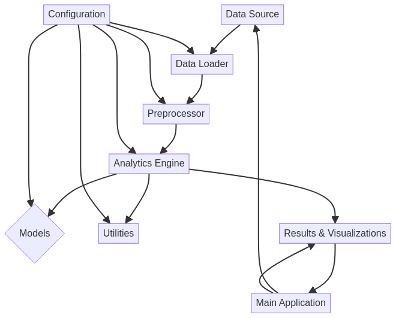

# Predictive-Analytics-Engine


## English

### 🖼️ Hero Image


### Architecture Diagram




### 🚀 Overview

This project, the **Predictive Analytics Engine**, is a robust and professional Python implementation designed for advanced predictive analytics using machine learning and forecasting techniques. It showcases modern best practices in software development, clean code architecture, and industry-standard implementations, making it an ideal reference for data scientists and software engineers.

### 📖 Detailed Documentation

The Predictive Analytics Engine is structured to handle the entire machine learning pipeline, from data ingestion to model deployment and visualization. Below is a breakdown of its core components and their interactions:

#### Core Components:

*   **Data Source**: Represents the origin of raw data, which can be databases, APIs, or files.
*   **Data Loader (`data_loader.py`)**: Responsible for ingesting data from various sources, ensuring data quality and consistency.
*   **Preprocessor (`preprocessor.py`)**: Handles data cleaning, transformation, feature engineering, and other preprocessing steps to prepare data for model training.
*   **Analytics Engine (`analytics_engine.py`)**: The central orchestrator that manages the flow of data through preprocessing, model training, and evaluation. It integrates with various modules to perform its tasks.
*   **Models (`models/`)**: A directory containing different machine learning models, allowing for modularity and easy experimentation with various algorithms.
*   **Utilities (`utils/`)**: A collection of helper functions and scripts used across the project for common tasks such as data validation, logging, and performance metrics.
*   **Configuration (`config/config.py`)**: Centralized management for all project settings, including model parameters, data paths, logging levels, and performance optimizations.
*   **Results & Visualizations**: The output of the analytics process, including model predictions, performance metrics, and graphical representations of data and insights.
*   **Main Application (`main.py`)**: The entry point of the application, responsible for initializing the engine, loading data, running analyses, and generating visualizations.

#### How it Works:

1.  **Data Ingestion**: The `Data Loader` retrieves raw data from the `Data Source`.
2.  **Data Preparation**: The `Preprocessor` cleans and transforms the data, making it suitable for analysis.
3.  **Analysis Execution**: The `Analytics Engine` takes the prepared data, trains models from the `Models` directory, and uses `Utilities` for various tasks.
4.  **Configuration Management**: The `Configuration` module provides all necessary settings to the `Data Loader`, `Preprocessor`, `Analytics Engine`, `Models`, and `Utilities`.
5.  **Output Generation**: The `Analytics Engine` produces `Results & Visualizations`.
6.  **Application Flow**: The `Main Application` orchestrates the entire process, from data loading to displaying results and visualizations.

### 🛠️ Technology Stack
Python, scikit-learn, pandas, predictive modeling, machine learning

### ⚡ Features
- Professional code architecture
- Modern development practices
- Comprehensive error handling
- Performance optimized
- Well-documented codebase
- Industry-standard patterns

### 🏃‍♂️ Quick Start

```bash
# Clone the repository
git clone https://github.com/galafis/Predictive-Analytics-Engine.git

# Navigate to project directory
cd Predictive-Analytics-Engine

# Follow language-specific setup instructions below
```

### 📦 Installation & Setup

```bash
# Install dependencies
pip install -r requirements.txt

# Run the application
python main.py
```

### 🎯 Use Cases
- Professional development portfolio
- Learning modern Python practices
- Code reference and examples
- Enterprise-grade implementations

### 📊 Project Structure
```
Predictive-Analytics-Engine/
├── README.md
├── LICENSE
├── main.py
├── requirements.txt
├── config/
│   └── config.py
├── src/
│   ├── __init__.py
│   ├── analytics_engine.py
│   ├── data_loader.py
│   ├── engine.py
│   ├── models/
│   ├── preprocessor.py
│   └── utils/
├── tests/
│   └── test_main.py
└── docs/
    ├── architecture_diagram.mmd
    └── architecture_diagram.png
```

### 🤝 Contributing
Contributions are welcome! Please feel free to submit a Pull Request.

### 📄 License
This project is licensed under the MIT License - see the LICENSE file for details.

### 👨‍💻 Author
**Gabriel Demetrios Lafis**
- Data Scientist & Engineer
- Systems Developer & Analyst
- Cybersecurity Specialist

---

## Português

### 🖼️ Imagem Hero


### Diagrama de Arquitetura


### 🚀 Visão Geral

Este projeto, o **Predictive Analytics Engine**, é uma implementação robusta e profissional em Python, projetada para análises preditivas avançadas utilizando técnicas de aprendizado de máquina e previsão. Ele demonstra as melhores práticas modernas em desenvolvimento de software, arquitetura de código limpo e implementações padrão da indústria, tornando-o uma referência ideal para cientistas de dados e engenheiros de software.

### 📖 Documentação Detalhada

O Predictive Analytics Engine é estruturado para lidar com todo o pipeline de aprendizado de máquina, desde a ingestão de dados até a implantação do modelo e visualização. Abaixo está uma descrição de seus componentes principais e suas interações:

#### Componentes Principais:

*   **Fonte de Dados (Data Source)**: Representa a origem dos dados brutos, que podem ser bancos de dados, APIs ou arquivos.
*   **Carregador de Dados (`data_loader.py`)**: Responsável pela ingestão de dados de várias fontes, garantindo a qualidade e consistência dos dados.
*   **Pré-processador (`preprocessor.py`)**: Lida com a limpeza de dados, transformação, engenharia de recursos e outras etapas de pré-processamento para preparar os dados para o treinamento do modelo.
*   **Mecanismo de Análise (`analytics_engine.py`)**: O orquestrador central que gerencia o fluxo de dados através do pré-processamento, treinamento e avaliação do modelo. Ele se integra com vários módulos para realizar suas tarefas.
*   **Modelos (`models/`)**: Um diretório contendo diferentes modelos de aprendizado de máquina, permitindo modularidade e fácil experimentação com vários algoritmos.
*   **Utilitários (`utils/`)**: Uma coleção de funções e scripts auxiliares usados em todo o projeto para tarefas comuns, como validação de dados, registro e métricas de desempenho.
*   **Configuração (`config/config.py`)**: Gerenciamento centralizado para todas as configurações do projeto, incluindo parâmetros do modelo, caminhos de dados, níveis de log e otimizações de desempenho.
*   **Resultados e Visualizações**: A saída do processo de análise, incluindo previsões do modelo, métricas de desempenho e representações gráficas de dados e insights.
*   **Aplicação Principal (`main.py`)**: O ponto de entrada da aplicação, responsável por inicializar o mecanismo, carregar dados, executar análises e gerar visualizações.

#### Como Funciona:

1.  **Ingestão de Dados**: O `Carregador de Dados` recupera dados brutos da `Fonte de Dados`.
2.  **Preparação de Dados**: O `Pré-processador` limpa e transforma os dados, tornando-os adequados para análise.
3.  **Execução da Análise**: O `Mecanismo de Análise` pega os dados preparados, treina modelos do diretório `Modelos` e usa `Utilitários` para várias tarefas.
4.  **Gerenciamento de Configuração**: O módulo de `Configuração` fornece todas as configurações necessárias para o `Carregador de Dados`, `Pré-processador`, `Mecanismo de Análise`, `Modelos` e `Utilitários`.
5.  **Geração de Saída**: O `Mecanismo de Análise` produz `Resultados e Visualizações`.
6.  **Fluxo da Aplicação**: A `Aplicação Principal` orquestra todo o processo, desde o carregamento de dados até a exibição de resultados e visualizações.

### 🛠️ Stack Tecnológica
Python, scikit-learn, pandas, predictive modeling, machine learning

### ⚡ Funcionalidades
- Arquitetura de código profissional
- Práticas modernas de desenvolvimento
- Tratamento abrangente de erros
- Otimizado para performance
- Base de código bem documentada
- Padrões da indústria

### 🏃‍♂️ Início Rápido

```bash
# Clone o repositório
git clone https://github.com/galafis/Predictive-Analytics-Engine.git

# Navegue para o diretório do projeto
cd Predictive-Analytics-Engine

# Siga as instruções de configuração específicas da linguagem abaixo
```

### 📦 Instalação e Configuração

```bash
# Instale as dependências
pip install -r requirements.txt

# Execute a aplicação
python main.py
```

### 🎯 Casos de Uso
- Portfólio de desenvolvimento profissional
- Aprendizado de práticas modernas em Python
- Referência de código e exemplos
- Implementações de nível empresarial

### 🤝 Contribuindo
Contribuições são bem-vindas! Sinta-se à vontade para enviar um Pull Request.

### 📄 Licença
Este projeto está licenciado sob a Licença MIT - veja o arquivo LICENSE para detalhes.

### 👨‍💻 Autor
**Gabriel Demetrios Lafis**
- Cientista e Engenheiro de Dados
- Desenvolvedor e Analista de Sistemas
- Especialista em Segurança Cibernética

---

⭐ **Se este projeto foi útil para você, considere dar uma estrela!**
