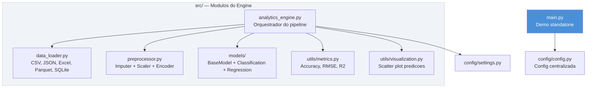
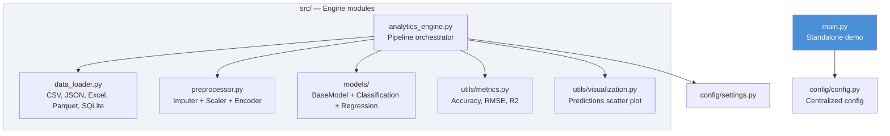

# Predictive-Analytics-Engine

Pipeline de analytics preditivo com modulos de carregamento de dados, preprocessamento,
modelos de classificacao/regressao e visualizacao.

[](https://python.org)
[](https://scikit-learn.org)
[](LICENSE)

[Portugues](#portugues) | [English](#english)

---

## Portugues

### Visao Geral

Projeto educacional que implementa um motor de analytics preditivo modular com:

- **DataLoader** — carregamento de dados de CSV, JSON, Excel, Parquet, SQLite e URL, com cache e validacao
- **Preprocessor** — pipeline de preprocessamento com imputacao, scaling e one-hot encoding via scikit-learn `ColumnTransformer`
- **Modelos** — wrappers para `LogisticRegression` (classificacao) e `LinearRegression` (regressao) com interface `BaseModel`, factory `get_model()` e persistencia via pickle
- **Metricas** — calculo automatico de accuracy/precision/recall/F1 (classificacao) ou RMSE/R2 (regressao)
- **Visualizacao** — scatter plot de predicoes vs valores reais
- **Configuracao** — sistema de configuracao centralizado via dataclasses com JSON serialization

O `main.py` fornece um demo standalone que gera dados sinteticos, treina um `RandomForestClassifier` e salva graficos EDA.

### Arquitetura



### Como Executar

```bash
# Clonar repositorio
git clone https://github.com/galafis/Predictive-Analytics-Engine.git
cd Predictive-Analytics-Engine

# Criar ambiente virtual
python -m venv venv
source venv/bin/activate  # Windows: venv\Scripts\activate

# Instalar dependencias
pip install -r requirements.txt

# Executar demo (dados sinteticos + Random Forest + graficos EDA)
python main.py

# Executar testes
pytest tests/ -v
```

### Saida

O `main.py` gera:
- Metricas de classificacao no terminal (accuracy, precision, recall, F1)
- Arquivo `predictive_analytics_analysis.png` com 4 graficos EDA

### Uso do Engine (src/)

```python
from src.data_loader import DataLoader
from src.preprocessor import Preprocessor
from src.models import get_model

# Carregar dados
loader = DataLoader()
df = loader.load("data.csv")

# Preprocessar
prep = Preprocessor()
result = prep.transform(df, target="target")
X_train, X_test, y_train, y_test = prep.split(result["X"], result["y"])

# Treinar modelo
model = get_model("classification")
model.fit(X_train, y=y_train)
preds = model.predict(X_test)
```

### Estrutura do Projeto

```
Predictive-Analytics-Engine/
├── main.py                     # Demo standalone (RandomForest + EDA)
├── requirements.txt            # Dependencias Python
├── config/
│   ├── __init__.py
│   ├── config.py               # Config centralizada (dataclasses + JSON)
│   └── settings.py             # Settings para o engine (preprocessor)
├── src/
│   ├── __init__.py
│   ├── analytics_engine.py     # Orquestrador do pipeline
│   ├── data_loader.py          # Carregamento multi-formato
│   ├── preprocessor.py         # Pipeline de preprocessamento
│   ├── models/
│   │   ├── __init__.py         # get_model() factory + MODEL_REGISTRY
│   │   ├── base_model.py       # ABC com fit/predict/save/load
│   │   ├── classification.py   # LogisticRegression wrapper
│   │   └── regression.py       # LinearRegression wrapper
│   └── utils/
│       ├── __init__.py
│       ├── metrics.py          # Classification + regression metrics
│       └── visualization.py    # Scatter plot de predicoes
├── tests/
│   ├── __init__.py
│   └── test_main.py            # ~30 testes funcionais
├── docs/
│   └── architecture_diagram.mmd
├── LICENSE
└── README.md
```

### Stack Tecnologica

| Tecnologia | Uso |
|------------|-----|
| Python 3.10+ | Linguagem principal |
| scikit-learn | Modelos, preprocessamento, metricas |
| pandas | Carregamento e manipulacao de dados |
| NumPy | Operacoes numericas |
| matplotlib | Graficos e visualizacoes |
| seaborn | Estilos e plots estatisticos |
| pytest | Testes funcionais |

### Autor

**Gabriel Demetrios Lafis**
- GitHub: [@galafis](https://github.com/galafis)
- LinkedIn: [Gabriel Demetrios Lafis](https://linkedin.com/in/gabriel-demetrios-lafis)

### Licenca

Licenciado sob a Licenca MIT - veja [LICENSE](LICENSE).

---

## English

### Overview

Educational project implementing a modular predictive analytics engine with:

- **DataLoader** — load data from CSV, JSON, Excel, Parquet, SQLite, and URLs with caching and validation
- **Preprocessor** — preprocessing pipeline with imputation, scaling, and one-hot encoding via scikit-learn `ColumnTransformer`
- **Models** — wrappers for `LogisticRegression` (classification) and `LinearRegression` (regression) with `BaseModel` interface, `get_model()` factory, and pickle persistence
- **Metrics** — automatic computation of accuracy/precision/recall/F1 (classification) or RMSE/R2 (regression)
- **Visualization** — scatter plot of predictions vs actual values
- **Configuration** — centralized config system via dataclasses with JSON serialization

`main.py` provides a standalone demo that generates synthetic data, trains a `RandomForestClassifier`, and saves EDA charts.

### Architecture



### Quick Start

```bash
git clone https://github.com/galafis/Predictive-Analytics-Engine.git
cd Predictive-Analytics-Engine
python -m venv venv
source venv/bin/activate
pip install -r requirements.txt
python main.py
pytest tests/ -v
```

### Output

`main.py` produces:
- Classification metrics printed to terminal (accuracy, precision, recall, F1)
- `predictive_analytics_analysis.png` file with 4 EDA charts

### Engine Usage (src/)

```python
from src.data_loader import DataLoader
from src.preprocessor import Preprocessor
from src.models import get_model

loader = DataLoader()
df = loader.load("data.csv")

prep = Preprocessor()
result = prep.transform(df, target="target")
X_train, X_test, y_train, y_test = prep.split(result["X"], result["y"])

model = get_model("classification")
model.fit(X_train, y=y_train)
preds = model.predict(X_test)
```

### Project Structure

```
Predictive-Analytics-Engine/
├── main.py                     # Standalone demo (RandomForest + EDA)
├── requirements.txt            # Python dependencies
├── config/
│   ├── __init__.py
│   ├── config.py               # Centralized config (dataclasses + JSON)
│   └── settings.py             # Engine settings (preprocessor)
├── src/
│   ├── __init__.py
│   ├── analytics_engine.py     # Pipeline orchestrator
│   ├── data_loader.py          # Multi-format data loading
│   ├── preprocessor.py         # Preprocessing pipeline
│   ├── models/
│   │   ├── __init__.py         # get_model() factory + MODEL_REGISTRY
│   │   ├── base_model.py       # ABC with fit/predict/save/load
│   │   ├── classification.py   # LogisticRegression wrapper
│   │   └── regression.py       # LinearRegression wrapper
│   └── utils/
│       ├── __init__.py
│       ├── metrics.py          # Classification + regression metrics
│       └── visualization.py    # Predictions scatter plot
├── tests/
│   ├── __init__.py
│   └── test_main.py            # ~30 functional tests
├── docs/
│   └── architecture_diagram.mmd
├── LICENSE
└── README.md
```

### Tech Stack

| Technology | Usage |
|------------|-------|
| Python 3.10+ | Primary language |
| scikit-learn | Models, preprocessing, metrics |
| pandas | Data loading and manipulation |
| NumPy | Numerical operations |
| matplotlib | Charts and visualizations |
| seaborn | Statistical plot styles |
| pytest | Functional tests |

### Author

**Gabriel Demetrios Lafis**
- GitHub: [@galafis](https://github.com/galafis)
- LinkedIn: [Gabriel Demetrios Lafis](https://linkedin.com/in/gabriel-demetrios-lafis)

### License

Licensed under the MIT License - see [LICENSE](LICENSE).
