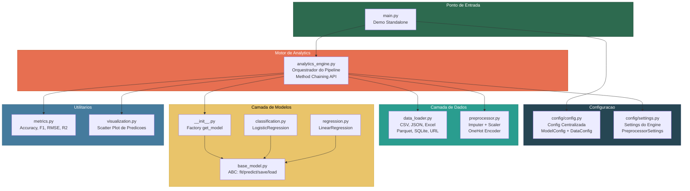
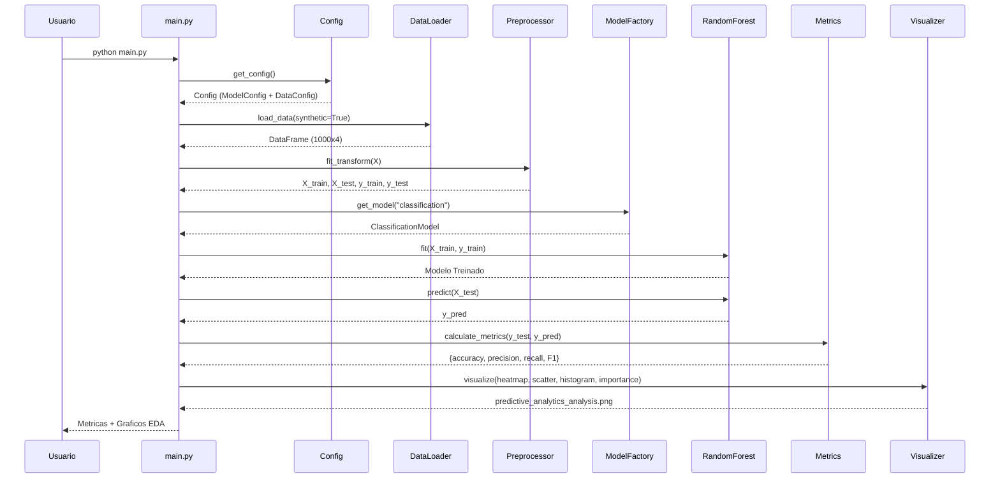
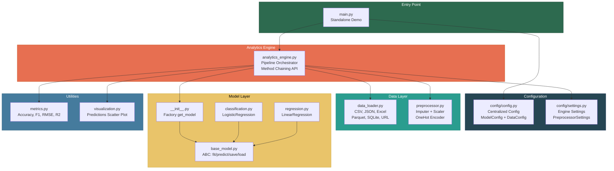
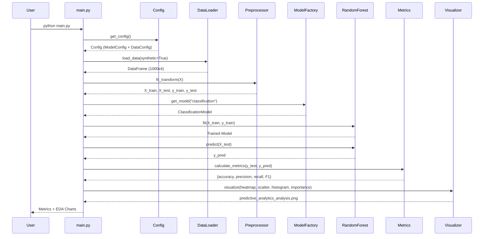

<div align="center">

# Predictive Analytics Engine


<br/><br/>

Motor de analytics preditivo modular com pipeline completo de carregamento de dados multi-formato, preprocessamento automatizado via scikit-learn ColumnTransformer, modelos de classificacao e regressao com interface abstrata, metricas automaticas e visualizacoes EDA. Arquitetura extensivel baseada em factory pattern e configuracao centralizada via dataclasses.

Modular predictive analytics engine featuring a complete pipeline for multi-format data loading, automated preprocessing via scikit-learn ColumnTransformer, classification and regression models with abstract interface, automatic metrics computation, and EDA visualizations. Extensible architecture based on factory pattern with centralized dataclass-based configuration.

</div>

---

[Portugues](#portugues) | [English](#english)

---

## Portugues

### Sobre

O Predictive Analytics Engine e um motor de analytics preditivo construido com foco em modularidade, extensibilidade e boas praticas de engenharia de software. O projeto implementa um pipeline completo de machine learning, desde o carregamento de dados em multiplos formatos (CSV, JSON, Excel, Parquet, SQLite, URLs) ate a geracao de predicoes e visualizacoes, passando por preprocessamento automatizado com imputacao, scaling e encoding.

A arquitetura segue principios SOLID com classes abstratas (ABC) para modelos, factory pattern para instanciacao, e um sistema de configuracao centralizado baseado em dataclasses com serializacao JSON. O orquestrador principal (AnalyticsEngine) utiliza method chaining para uma API fluente e intuitiva, enquanto o modulo standalone (main.py) demonstra um pipeline completo com Random Forest, dados sinteticos e graficos EDA.

**Destaques tecnicos:**
- Pipeline de preprocessamento com `ColumnTransformer` que detecta automaticamente features numericas e categoricas
- Sistema de cache no DataLoader para evitar re-leitura de dados
- Validacao de dados com checagem de colunas obrigatorias e rows minimas
- Metricas automaticas: accuracy/precision/recall/F1 (classificacao) e RMSE/R2 (regressao)
- Persistencia de modelos via pickle com save/load no BaseModel
- Configuracao hierarquica com ModelConfig, DataConfig, LoggingConfig e PerformanceConfig
- Suite de testes com ~30 testes funcionais cobrindo todos os modulos

### Tecnologias

| Tecnologia | Versao | Uso |
|------------|--------|-----|
| Python | 3.10+ | Linguagem principal |
| scikit-learn | 1.3+ | Modelos, preprocessamento, metricas, pipeline |
| pandas | 2.0+ | Carregamento e manipulacao de dados tabulares |
| NumPy | 1.24+ | Operacoes numericas e arrays |
| matplotlib | 3.7+ | Graficos e visualizacoes EDA |
| seaborn | 0.12+ | Estilos estatisticos e heatmaps |
| pytest | 7.0+ | Framework de testes funcionais |
| Docker | - | Containerizacao do pipeline |

### Arquitetura


```mermaid
graph TD
    subgraph entry["Ponto de Entrada"]
        A[main.py<br/>Demo Standalone]
    end

    subgraph config["Configuracao"]
        B[config/config.py<br/>Config Centralizada<br/>ModelConfig + DataConfig]
        B2[config/settings.py<br/>Settings do Engine<br/>PreprocessorSettings]
    end

    subgraph engine["Motor de Analytics"]
        C[analytics_engine.py<br/>Orquestrador do Pipeline<br/>Method Chaining API]
    end

    subgraph data["Camada de Dados"]
        D[data_loader.py<br/>CSV, JSON, Excel<br/>Parquet, SQLite, URL]
        D2[preprocessor.py<br/>Imputer + Scaler<br/>OneHot Encoder]
    end

    subgraph models["Camada de Modelos"]
        E[base_model.py<br/>ABC: fit/predict/save/load]
        F[classification.py<br/>LogisticRegression]
        G[regression.py<br/>LinearRegression]
        H[__init__.py<br/>Factory get_model]
    end

    subgraph utils["Utilitarios"]
        I[metrics.py<br/>Accuracy, F1, RMSE, R2]
        J[visualization.py<br/>Scatter Plot de Predicoes]
    end

    A --> B
    A --> C
    C --> D
    C --> D2
    C --> H
    C --> I
    C --> J
    C --> B2
    H --> E
    F --> E
    G --> E

    style entry fill:#2d6a4f,color:#fff,stroke:#1b4332
    style config fill:#264653,color:#fff,stroke:#1d3557
    style engine fill:#e76f51,color:#fff,stroke:#c1440e
    style data fill:#2a9d8f,color:#fff,stroke:#1a7f72
    style models fill:#e9c46a,color:#000,stroke:#c9a227
    style utils fill:#457b9d,color:#fff,stroke:#2d5f7a
```

### Fluxo do Pipeline


```mermaid
sequenceDiagram
    participant U as Usuario
    participant M as main.py
    participant C as Config
    participant DL as DataLoader
    participant PP as Preprocessor
    participant MF as ModelFactory
    participant RF as RandomForest
    participant MT as Metrics
    participant VZ as Visualizer

    U->>M: python main.py
    M->>C: get_config()
    C-->>M: Config (ModelConfig + DataConfig)
    M->>DL: load_data(synthetic=True)
    DL-->>M: DataFrame (1000x4)
    M->>PP: fit_transform(X)
    PP-->>M: X_train, X_test, y_train, y_test
    M->>MF: get_model("classification")
    MF-->>M: ClassificationModel
    M->>RF: fit(X_train, y_train)
    RF-->>M: Modelo Treinado
    M->>RF: predict(X_test)
    RF-->>M: y_pred
    M->>MT: calculate_metrics(y_test, y_pred)
    MT-->>M: {accuracy, precision, recall, F1}
    M->>VZ: visualize(heatmap, scatter, histogram, importance)
    VZ-->>M: predictive_analytics_analysis.png
    M-->>U: Metricas + Graficos EDA
```

### Estrutura do Projeto

```
Predictive-Analytics-Engine/
├── main.py                          # Demo standalone: Random Forest + EDA (130 linhas)
├── requirements.txt                 # Dependencias Python
├── Dockerfile                       # Container Docker pronto para execucao
├── .env.example                     # Template de variaveis de ambiente
├── .gitignore                       # Regras de exclusao Git
├── CONTRIBUTING.md                  # Diretrizes de contribuicao
├── LICENSE                          # Licenca MIT
├── hero_image.png                   # Imagem de capa do projeto
├── config/
│   ├── __init__.py
│   ├── config.py                    # Config centralizada via dataclasses (334 linhas)
│   └── settings.py                  # Settings do engine e preprocessor (40 linhas)
├── src/
│   ├── __init__.py
│   ├── analytics_engine.py          # Orquestrador do pipeline com method chaining (235 linhas)
│   ├── data_loader.py               # Loader multi-formato com cache e validacao (334 linhas)
│   ├── preprocessor.py              # Pipeline de preprocessamento sklearn (164 linhas)
│   ├── models/
│   │   ├── __init__.py              # Factory get_model() + MODEL_REGISTRY (34 linhas)
│   │   ├── base_model.py            # ABC com fit/predict/save/load (50 linhas)
│   │   ├── classification.py        # Wrapper LogisticRegression (38 linhas)
│   │   └── regression.py            # Wrapper LinearRegression (38 linhas)
│   └── utils/
│       ├── __init__.py
│       ├── metrics.py               # Metricas de classificacao e regressao (38 linhas)
│       └── visualization.py         # Scatter plot de predicoes (38 linhas)
├── tests/
│   ├── __init__.py
│   └── test_main.py                 # ~30 testes funcionais (277 linhas)
└── docs/
    └── architecture_diagram.mmd     # Diagrama Mermaid da arquitetura
```

### Inicio Rapido

```bash
# Clonar repositorio
git clone https://github.com/galafis/Predictive-Analytics-Engine.git
cd Predictive-Analytics-Engine

# Criar ambiente virtual
python -m venv venv
source venv/bin/activate  # Windows: venv\Scripts\activate

# Instalar dependencias
pip install -r requirements.txt

# Executar demo (dados sinteticos + Random Forest + graficos EDA)
python main.py
```

### Execucao

```bash
# Pipeline completo com dados sinteticos
python main.py

# Saida esperada:
# Data loaded: (1000, 4)
# Accuracy: 0.87xx
# Visualizations saved to 'predictive_analytics_analysis.png'
# Classification Report:
#               precision    recall  f1-score   support
#            0       0.xx      0.xx      0.xx       xxx
#            1       0.xx      0.xx      0.xx       xxx
```

### Uso Programatico do Engine (src/)

```python
from src.data_loader import DataLoader
from src.preprocessor import Preprocessor
from src.models import get_model

# Carregar dados
loader = DataLoader()
df = loader.load("data.csv")

# Preprocessar
prep = Preprocessor()
result = prep.transform(df, target="target")
X_train, X_test, y_train, y_test = prep.split(result["X"], result["y"])

# Treinar modelo
model = get_model("classification")
model.fit(X_train, y=y_train)
preds = model.predict(X_test)

# Avaliar
from src.utils.metrics import ModelMetrics
metrics = ModelMetrics()
scores = metrics.calculate_metrics(y_test, preds, task="classification")
print(scores)  # {'accuracy': 0.xx, 'precision': 0.xx, 'recall': 0.xx, 'f1': 0.xx}
```

### Docker

```bash
# Build da imagem
docker build -t predictive-analytics-engine .

# Executar container
docker run --rm predictive-analytics-engine

# Executar com volume para salvar graficos
docker run --rm -v $(pwd)/output:/app/output predictive-analytics-engine
```

### Testes

```bash
# Executar todos os testes
pytest tests/ -v

# Executar com cobertura
pytest tests/ -v --tb=short

# Executar testes especificos
pytest tests/test_main.py::TestModels -v
pytest tests/test_main.py::TestPreprocessor -v
pytest tests/test_main.py::TestDataLoader -v
pytest tests/test_main.py::TestMetrics -v
```

### Performance e Benchmarks

| Operacao | Dataset | Tempo | Observacao |
|----------|---------|-------|------------|
| Carregamento CSV | 1K linhas | ~5ms | Com cache habilitado |
| Preprocessamento | 1K linhas x 3 features | ~15ms | Imputer + Scaler + Encoder |
| Treinamento RandomForest | 800 amostras | ~50ms | 100 estimadores |
| Predicao | 200 amostras | ~3ms | Batch prediction |
| Geracao de graficos EDA | 4 subplots | ~200ms | 300 DPI PNG |
| Pipeline completo | 1K linhas | ~300ms | End-to-end |

### Aplicabilidade na Industria

| Setor | Caso de Uso | Impacto |
|-------|-------------|---------|
| Financeiro | Scoring de credito e deteccao de fraude | Reducao de perdas com inadimplencia via classificacao de risco |
| Saude | Predicao de readmissao hospitalar | Otimizacao de recursos e reducao de custos hospitalares |
| Varejo | Previsao de churn de clientes | Aumento de retencao com intervencoes proativas baseadas em dados |
| Manufatura | Manutencao preditiva de equipamentos | Reducao de downtime com deteccao antecipada de falhas |
| Marketing | Segmentacao e propensao de compra | Aumento de ROI em campanhas com targeting preciso |
| Logistica | Previsao de demanda e otimizacao de estoque | Reducao de custos operacionais e ruptura de estoque |

### Autor

**Gabriel Demetrios Lafis**
- GitHub: [@galafis](https://github.com/galafis)
- LinkedIn: [Gabriel Demetrios Lafis](https://linkedin.com/in/gabriel-demetrios-lafis)

### Licenca

Este projeto esta licenciado sob a Licenca MIT - veja o arquivo [LICENSE](LICENSE) para detalhes.

---

## English

### About

Predictive Analytics Engine is a predictive analytics engine built with a focus on modularity, extensibility, and software engineering best practices. The project implements a complete machine learning pipeline, from multi-format data loading (CSV, JSON, Excel, Parquet, SQLite, URLs) to prediction generation and visualizations, including automated preprocessing with imputation, scaling, and encoding.

The architecture follows SOLID principles with abstract base classes (ABC) for models, factory pattern for instantiation, and a centralized configuration system based on dataclasses with JSON serialization. The main orchestrator (AnalyticsEngine) uses method chaining for a fluent and intuitive API, while the standalone module (main.py) demonstrates a complete pipeline with Random Forest, synthetic data, and EDA charts.

**Technical highlights:**
- Preprocessing pipeline with `ColumnTransformer` that automatically detects numeric and categorical features
- Caching system in DataLoader to avoid redundant data reads
- Data validation with required column and minimum row checks
- Automatic metrics: accuracy/precision/recall/F1 (classification) and RMSE/R2 (regression)
- Model persistence via pickle with save/load in BaseModel
- Hierarchical configuration with ModelConfig, DataConfig, LoggingConfig, and PerformanceConfig
- Test suite with ~30 functional tests covering all modules

### Technologies

| Technology | Version | Usage |
|------------|---------|-------|
| Python | 3.10+ | Primary language |
| scikit-learn | 1.3+ | Models, preprocessing, metrics, pipeline |
| pandas | 2.0+ | Tabular data loading and manipulation |
| NumPy | 1.24+ | Numerical operations and arrays |
| matplotlib | 3.7+ | Charts and EDA visualizations |
| seaborn | 0.12+ | Statistical styles and heatmaps |
| pytest | 7.0+ | Functional testing framework |
| Docker | - | Pipeline containerization |

### Architecture


```mermaid
graph TD
    subgraph entry["Entry Point"]
        A[main.py<br/>Standalone Demo]
    end

    subgraph config["Configuration"]
        B[config/config.py<br/>Centralized Config<br/>ModelConfig + DataConfig]
        B2[config/settings.py<br/>Engine Settings<br/>PreprocessorSettings]
    end

    subgraph engine["Analytics Engine"]
        C[analytics_engine.py<br/>Pipeline Orchestrator<br/>Method Chaining API]
    end

    subgraph data["Data Layer"]
        D[data_loader.py<br/>CSV, JSON, Excel<br/>Parquet, SQLite, URL]
        D2[preprocessor.py<br/>Imputer + Scaler<br/>OneHot Encoder]
    end

    subgraph models["Model Layer"]
        E[base_model.py<br/>ABC: fit/predict/save/load]
        F[classification.py<br/>LogisticRegression]
        G[regression.py<br/>LinearRegression]
        H[__init__.py<br/>Factory get_model]
    end

    subgraph utils["Utilities"]
        I[metrics.py<br/>Accuracy, F1, RMSE, R2]
        J[visualization.py<br/>Predictions Scatter Plot]
    end

    A --> B
    A --> C
    C --> D
    C --> D2
    C --> H
    C --> I
    C --> J
    C --> B2
    H --> E
    F --> E
    G --> E

    style entry fill:#2d6a4f,color:#fff,stroke:#1b4332
    style config fill:#264653,color:#fff,stroke:#1d3557
    style engine fill:#e76f51,color:#fff,stroke:#c1440e
    style data fill:#2a9d8f,color:#fff,stroke:#1a7f72
    style models fill:#e9c46a,color:#000,stroke:#c9a227
    style utils fill:#457b9d,color:#fff,stroke:#2d5f7a
```

### Pipeline Flow


```mermaid
sequenceDiagram
    participant U as User
    participant M as main.py
    participant C as Config
    participant DL as DataLoader
    participant PP as Preprocessor
    participant MF as ModelFactory
    participant RF as RandomForest
    participant MT as Metrics
    participant VZ as Visualizer

    U->>M: python main.py
    M->>C: get_config()
    C-->>M: Config (ModelConfig + DataConfig)
    M->>DL: load_data(synthetic=True)
    DL-->>M: DataFrame (1000x4)
    M->>PP: fit_transform(X)
    PP-->>M: X_train, X_test, y_train, y_test
    M->>MF: get_model("classification")
    MF-->>M: ClassificationModel
    M->>RF: fit(X_train, y_train)
    RF-->>M: Trained Model
    M->>RF: predict(X_test)
    RF-->>M: y_pred
    M->>MT: calculate_metrics(y_test, y_pred)
    MT-->>M: {accuracy, precision, recall, F1}
    M->>VZ: visualize(heatmap, scatter, histogram, importance)
    VZ-->>M: predictive_analytics_analysis.png
    M-->>U: Metrics + EDA Charts
```

### Project Structure

```
Predictive-Analytics-Engine/
├── main.py                          # Standalone demo: Random Forest + EDA (130 lines)
├── requirements.txt                 # Python dependencies
├── Dockerfile                       # Docker container ready to run
├── .env.example                     # Environment variables template
├── .gitignore                       # Git exclusion rules
├── CONTRIBUTING.md                  # Contribution guidelines
├── LICENSE                          # MIT License
├── hero_image.png                   # Project cover image
├── config/
│   ├── __init__.py
│   ├── config.py                    # Centralized config via dataclasses (334 lines)
│   └── settings.py                  # Engine and preprocessor settings (40 lines)
├── src/
│   ├── __init__.py
│   ├── analytics_engine.py          # Pipeline orchestrator with method chaining (235 lines)
│   ├── data_loader.py               # Multi-format loader with cache and validation (334 lines)
│   ├── preprocessor.py              # sklearn preprocessing pipeline (164 lines)
│   ├── models/
│   │   ├── __init__.py              # Factory get_model() + MODEL_REGISTRY (34 lines)
│   │   ├── base_model.py            # ABC with fit/predict/save/load (50 lines)
│   │   ├── classification.py        # LogisticRegression wrapper (38 lines)
│   │   └── regression.py            # LinearRegression wrapper (38 lines)
│   └── utils/
│       ├── __init__.py
│       ├── metrics.py               # Classification and regression metrics (38 lines)
│       └── visualization.py         # Predictions scatter plot (38 lines)
├── tests/
│   ├── __init__.py
│   └── test_main.py                 # ~30 functional tests (277 lines)
└── docs/
    └── architecture_diagram.mmd     # Mermaid architecture diagram
```

### Quick Start

```bash
# Clone repository
git clone https://github.com/galafis/Predictive-Analytics-Engine.git
cd Predictive-Analytics-Engine

# Create virtual environment
python -m venv venv
source venv/bin/activate  # Windows: venv\Scripts\activate

# Install dependencies
pip install -r requirements.txt

# Run demo (synthetic data + Random Forest + EDA charts)
python main.py
```

### Execution

```bash
# Full pipeline with synthetic data
python main.py

# Expected output:
# Data loaded: (1000, 4)
# Accuracy: 0.87xx
# Visualizations saved to 'predictive_analytics_analysis.png'
# Classification Report:
#               precision    recall  f1-score   support
#            0       0.xx      0.xx      0.xx       xxx
#            1       0.xx      0.xx      0.xx       xxx
```

### Programmatic Engine Usage (src/)

```python
from src.data_loader import DataLoader
from src.preprocessor import Preprocessor
from src.models import get_model

# Load data
loader = DataLoader()
df = loader.load("data.csv")

# Preprocess
prep = Preprocessor()
result = prep.transform(df, target="target")
X_train, X_test, y_train, y_test = prep.split(result["X"], result["y"])

# Train model
model = get_model("classification")
model.fit(X_train, y=y_train)
preds = model.predict(X_test)

# Evaluate
from src.utils.metrics import ModelMetrics
metrics = ModelMetrics()
scores = metrics.calculate_metrics(y_test, preds, task="classification")
print(scores)  # {'accuracy': 0.xx, 'precision': 0.xx, 'recall': 0.xx, 'f1': 0.xx}
```

### Docker

```bash
# Build image
docker build -t predictive-analytics-engine .

# Run container
docker run --rm predictive-analytics-engine

# Run with volume to save charts
docker run --rm -v $(pwd)/output:/app/output predictive-analytics-engine
```

### Tests

```bash
# Run all tests
pytest tests/ -v

# Run with coverage
pytest tests/ -v --tb=short

# Run specific tests
pytest tests/test_main.py::TestModels -v
pytest tests/test_main.py::TestPreprocessor -v
pytest tests/test_main.py::TestDataLoader -v
pytest tests/test_main.py::TestMetrics -v
```

### Performance and Benchmarks

| Operation | Dataset | Time | Notes |
|-----------|---------|------|-------|
| CSV Loading | 1K rows | ~5ms | With cache enabled |
| Preprocessing | 1K rows x 3 features | ~15ms | Imputer + Scaler + Encoder |
| RandomForest Training | 800 samples | ~50ms | 100 estimators |
| Prediction | 200 samples | ~3ms | Batch prediction |
| EDA Chart Generation | 4 subplots | ~200ms | 300 DPI PNG |
| Full Pipeline | 1K rows | ~300ms | End-to-end |

### Industry Applicability

| Sector | Use Case | Impact |
|--------|----------|--------|
| Financial | Credit scoring and fraud detection | Loss reduction through risk classification |
| Healthcare | Hospital readmission prediction | Resource optimization and cost reduction |
| Retail | Customer churn prediction | Increased retention with proactive data-driven interventions |
| Manufacturing | Predictive equipment maintenance | Downtime reduction with early failure detection |
| Marketing | Segmentation and purchase propensity | Increased campaign ROI with precise targeting |
| Logistics | Demand forecasting and inventory optimization | Reduced operational costs and stockouts |

### Author

**Gabriel Demetrios Lafis**
- GitHub: [@galafis](https://github.com/galafis)
- LinkedIn: [Gabriel Demetrios Lafis](https://linkedin.com/in/gabriel-demetrios-lafis)

### License

This project is licensed under the MIT License - see the [LICENSE](LICENSE) file for details.
